# 🎉 PartyPlus - BombParty Overlay
Un overlay pour dynamiser votre expérience du jeu BombParty avec un tas de fonctionnalités supplémentaires et une configuration profondément personnalisée.

## Sommaire
- [Installation](#installation)
- [Aperçu des fonctionnalités](#aperçu-des-fonctionnalités)
   - [Notifications de bureau](#notifications-de-bureau)
   - [Chat](#chat)
   - [Statistiques de partie](#statistiques-de-partie)
   - [Clavier](#clavier)
   - [Customisation](#customisation)
   - [Mode streamer](#mode-streamer)
   - [Mode entraînement](#mode-entraînement)
   - [Autre](#autre)   

## Installation
### 1. Installer l'extension
- Pour Chrome, Brave, Opera, etc : [Tampermonkey](https://chromewebstore.google.com/detail/tampermonkey/dhdgffkkebhmkfjojejmpbldmpobfkfo)
- Pour Firefox : [Greasemonkey](https://addons.mozilla.org/fr/firefox/addon/greasemonkey/)

### 2. Installer le script
Rendez-vous sur la page [GreasyFork](https://greasyfork.org/en/scripts/489420-partyplus-bombparty-overlay) du script et installez-le.

## Aperçu des fonctionnalités
Voici quelques-unes des fonctionnalités que PartyPlus offre. Pour en découvrir le reste, essayez-le par vous-même ! 🎉

### Notifications de bureau
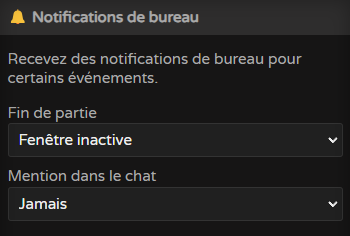
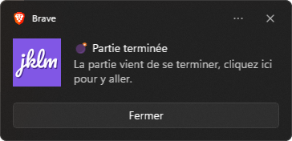

### Chat
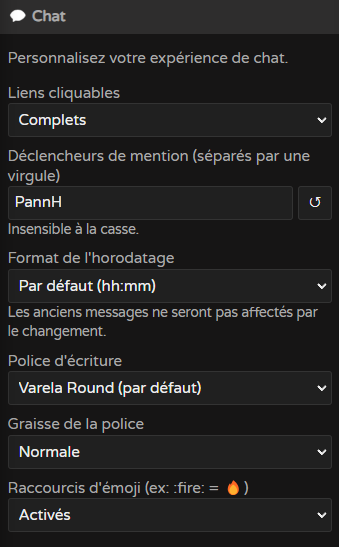
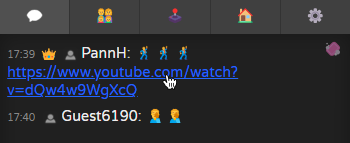
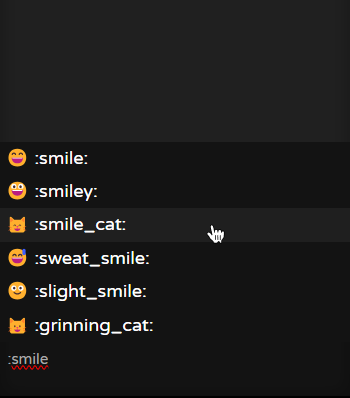

### Statistiques de partie
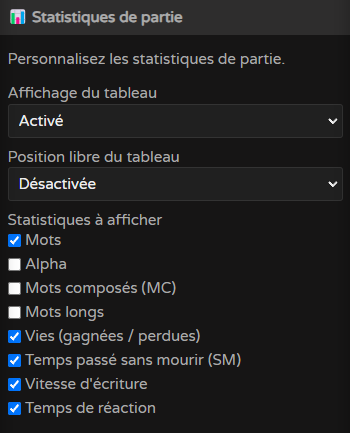
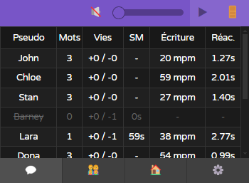

### Clavier
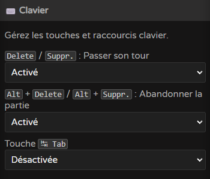

### Customisation
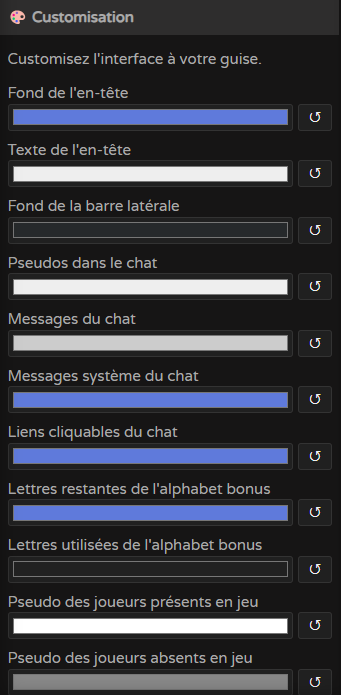
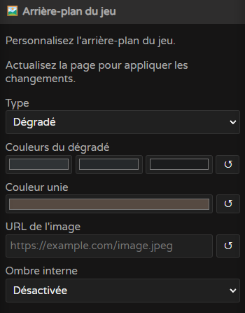
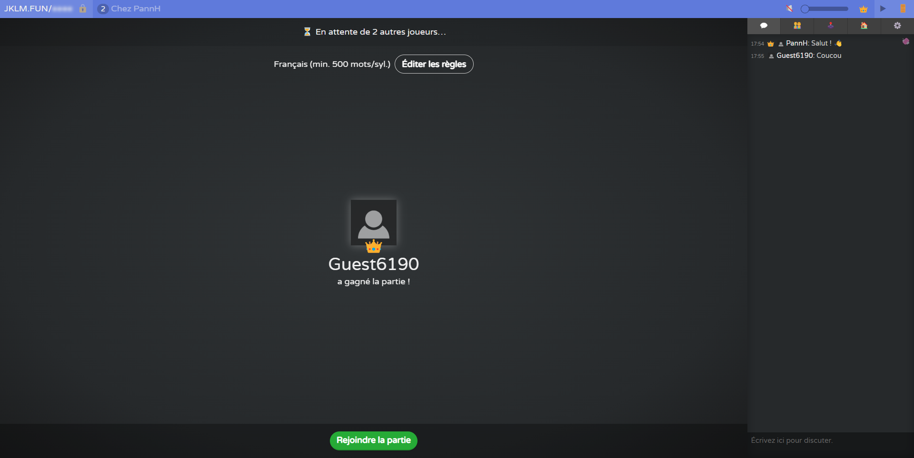

### Mode streamer
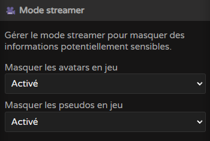
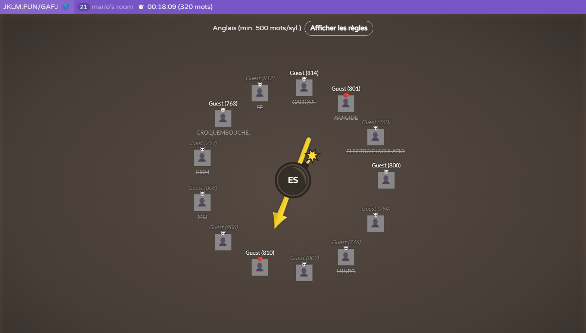

### Mode entraînement
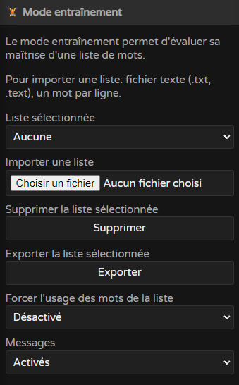

### Autre
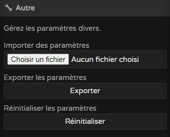